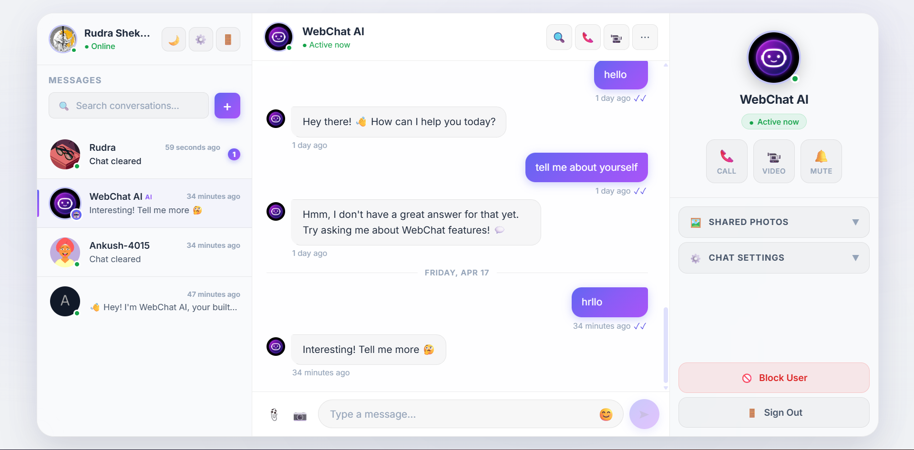
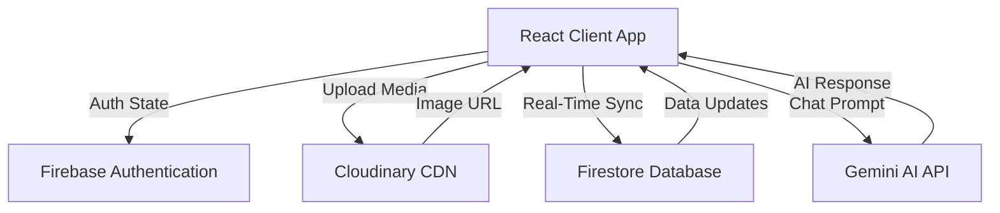

# WebChat

[](https://opensource.org/licenses/MIT)
[](https://reactjs.org/)
[](https://vitejs.dev/)
[](https://firebase.google.com/)

A real-time web-based messaging application built with React, Vite, and Firebase. This project demonstrates state synchronization, authentication, media management, and integration with the Gemini 1.5 Flash API.

**Live Demo:** [webchatxo.netlify.app](https://webchatxo.netlify.app/)

<div align="center">
  
</div>

---

## Table of Contents

- [Features](#features)
- [System Architecture](#system-architecture)
- [Technologies](#technologies)
- [Getting Started](#getting-started)
- [Available Scripts](#available-scripts)
- [Configuration Details](#configuration-details)
- [Deployment](#deployment)
- [Known Limitations](#known-limitations)
- [Contributing](#contributing)
- [Acknowledgements](#acknowledgements)
- [License](#license)

---

## Features

### AI Integration
* **Conversational Agent:** Integrates the Gemini 1.5 Flash API for chat interactions.
* **Auto-Provisioned Bots:** Each registered user receives an AI chat companion by default.

### Authentication & Security
* **Multi-Provider Auth:** Support for email/password registration and Google OAuth via Firebase Authentication.
* **Username Validation:** Validation checks for usernames to ensure distinct identifiability.
* **Access Control:** Firebase Security Rules enforce row-level access, limiting reads and writes to authenticated users and authorized participants.

### Messaging & Communication
* **Real-Time Data Sync:** Message delivery and state updates using Firestore's real-time listeners.
* **Media Handling:** Direct image uploads to the Cloudinary CDN.
* **Chat Management:** Controls to clear chat history, block/unblock specified users, and check online status.
* **Rich Text Capabilities:** Emoji support and relative timestamps.

### User Interface
* **Theming:** CSS variables supporting custom toggling between Light and Dark themes.
* **Responsive Layout:** Adaptive design targeting mobile, tablet, and desktop viewports.
* **Visuals:** Implements glassmorphism UI patterns and standard CSS transitions.

---

## System Architecture



---

## Technologies

### Core Stack
| Technology | Description |
|---|---|
| **React 18.2.0** | Frontend UI Library |
| **Vite 5.2.7** | Build Tool & Development Server |
| **Zustand** | State Management |
| **Vanilla CSS** | Styling & Theming |

### Backend & External Services
| Service | Purpose |
|---|---|
| **Firebase 9+** | Authentication & Database (Firestore) |
| **Cloudinary API** | Media Storage & Content Delivery |
| **@google/genai** | Integration with the Gemini 1.5 AI model |

### Utilities
* **Axios:** Promise-based HTTP client for external API calls
* **React Toastify:** Notification system
* **timeago.js:** Dynamic timestamps conversion
* **emoji-picker-react:** UI component for emoji selections

---

## Getting Started

### Prerequisites
* [Node.js](https://nodejs.org/en/) v16 or higher
* [npm](https://www.npmjs.com/) or [yarn](https://yarnpkg.com/)
* Accounts for [Firebase](https://firebase.google.com/), [Cloudinary](https://cloudinary.com/), and [Google AI Studio](https://aistudio.google.com/)

### Local Installation

1. **Clone the repository**
   ```bash
   git clone https://github.com/Rudra-729/Web_Chat.git
   cd Web_Chat
   ```

2. **Install dependencies**
   ```bash
   npm install
   ```

3. **Configure Environment Variables**
   Create a `.env.local` file in the root directory:
   ```env
   VITE_API_KEY="your_firebase_api_key"
   VITE_CLOUDINARY_CLOUD_NAME="your_cloudinary_cloud_name"
   VITE_CLOUDINARY_UPLOAD_PRESET="your_unsigned_upload_preset"
   VITE_GEMINI_API_KEY="your_gemini_api_key"
   ```

---

## Available Scripts

In the project directory, you can run the following commands:

| Command | Description |
|---|---|
| `npm run dev` | Runs the app in development mode at `http://localhost:5173`. |
| `npm run build` | Builds the application for production to the `dist` folder. |
| `npm run preview` | Serves the production build locally for testing. |

---

## Configuration Details

### Firebase Specifics
1. Provision a Firebase project and enable **Authentication** (Email/Password & Google options).
2. Provision a **Firestore** database instance.
3. Apply the following security constraints to your Firestore rules. 
   *(Note: The rule `allow create: if request.auth == null;` under the users collection is used temporarily during initial account creation where users may be provisioned before standard authentication is finalized. In a strict prod environment, consider moving user provisioning to Firebase Cloud Functions to avoid unauthenticated creates.)*

   ```javascript
   rules_version = '2';
   service cloud.firestore {
     match /databases/{database}/documents {
       match /users/{userId} {
         allow create: if request.auth == null;
         allow read, update, delete: if request.auth != null && request.auth.uid == userId;
       }
       match /userchats/{userId} {
         allow create: if request.auth == null;
         allow read, update, delete: if request.auth != null && request.auth.uid == userId;
       }
       match /chats/{chatId} {
         allow read, write: if request.auth != null;
       }
     }
   }
   ```

### Cloudinary Specifics
Create an **unsigned upload preset** from the Cloudinary dashboard under `Settings > Upload`.

---

## Deployment

Optimized for static hosting platforms such as Netlify or Vercel. Because this is a Single Page Application (SPA), ensure client-side routing is supported by mapping all unmatched path requests to `index.html`.

For Netlify, this handles via a `_redirects` file at the root of `public/` (or `dist/`) with the following contents:
```
/*    /index.html   200
```

---

## Known Limitations

- **Scalability of Reads:** The current chat query listener fetches standard amounts of active chats. In highly scaled environments (10,000+ messages), pagination or cursor-based infinite scrolling will be required.
- **Unauthenticated Users Collection Create:** Due to frontend-only signup flow logic, the Firestore rules temporarily permit unauthenticated clients to register usernames. This could be mitigated manually by implementing Firebase Admin SDK via Cloud Functions.
- **Media Optimization:** Images uploaded to Cloudinary are currently inserted in standard quality and may increase bandwidth. Implementation of Cloudinary image transformations in the URL is planned.

---

## Contributing

Contributions are always welcome. We appreciate pull requests and issues being opened for bugs, enhancements, and suggestions.

1. **Fork the repository** and create your branch from `main`.
2. **If you've added new functionality**, update the documentation.
3. Ensure your code follows the existing style guidelines.
4. **Issue Reports**: Please include replication steps, expected behavior, and actual behavior when filing a bug.

---

## Acknowledgements

Special thanks to the open-source community and the providers of the core technologies that made this project possible:
* [Firebase](https://firebase.google.com/) - Database and authentication services
* [Cloudinary](https://cloudinary.com/) - Image management API
* [Google Gemini](https://ai.google.dev/) - Generative AI models

Developed by **Rudra Shekhar**.

---

## License

This project is open-source and available under the terms of the MIT License.
